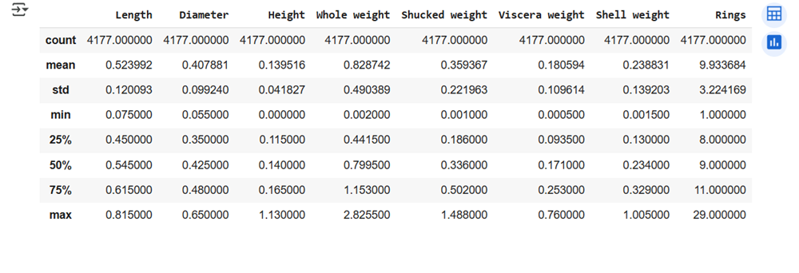
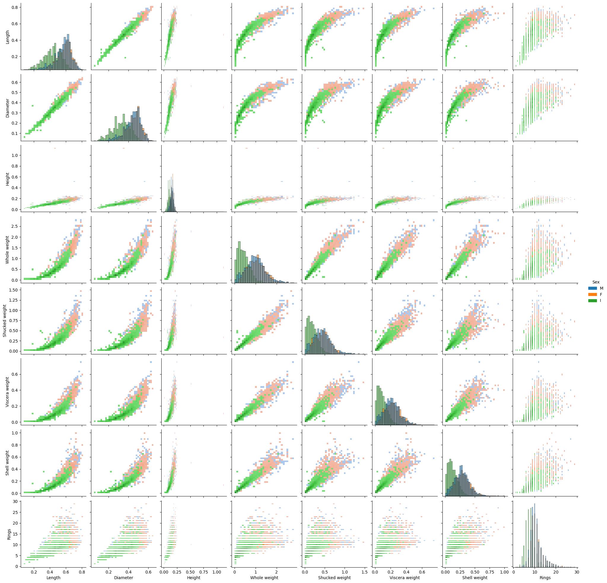
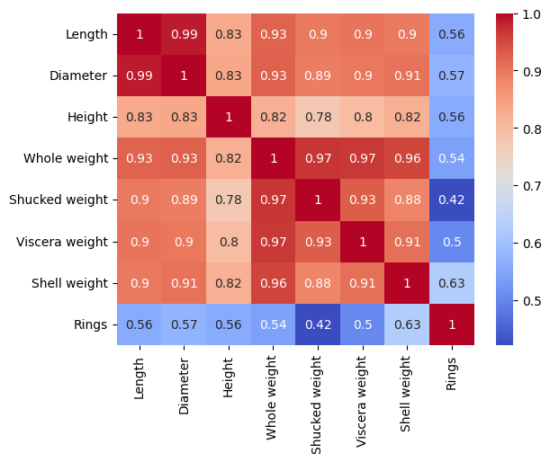
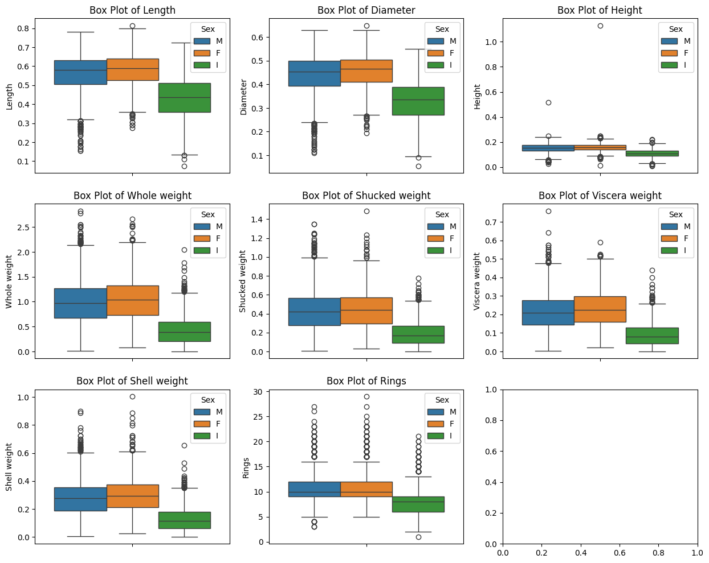
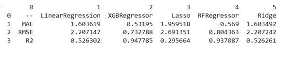
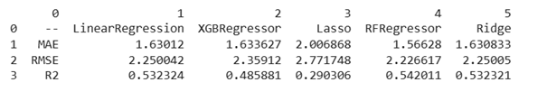
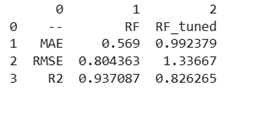
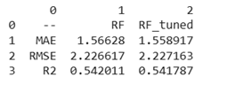

# Prediction of Abalone Age Using Regression Models


---

## Introduction

Abalone is a marine shellfish, rich in protein and omega-3 fatty acids. These sea snails have a distinctive flattened, ear-shaped shell and muscular foot. As abalones grow, their shells form **concentric rings**, similar to tree rings, which can be used to estimate age.

However, **manual ring counting** under a microscope is time-consuming and prone to error. Moreover, ring formation is influenced not only by age but also by **environmental and feeding factors**. Since **abalone value is age-dependent**, it becomes important to develop efficient methods to estimate age.

This project leverages **machine learning regression models** to predict the number of rings — and hence the age — using various physical measurements of the abalone, offering a faster and more scalable alternative.

---

## Project Goals

- Predict the age of abalone using physical measurements.
- Compare the performance of multiple regression models.
- Evaluate results using metrics like **MAE**, **RMSE**, and **R²**.
- Explore hyperparameter tuning to boost performance.
- Improve model generalization and accuracy on unseen data.

---

## Dependencies and Libraries Used

- `numpy`
- `pandas`
- `matplotlib`
- `seaborn`
- `sklearn`
- `xgboost`, `linear_models`, `ensemble`
- `google.colab.drive` (for accessing data)

---

## Dataset

**Source**:  
[UCI Machine Learning Repository - Abalone Dataset](https://archive.ics.uci.edu/ml/datasets/Abalone)  
**Donated by**: Warwick J. Nash et al., 1995  
**Total Observations**: 4177  
**Total Features**: 9  
**Missing Values**: None

**Original Study Reference**:  
*The Population Biology of Abalone (Haliotis species) in Tasmania* — Sea Fisheries Division, Technical Report No. 48.

---

## Data Cleaning and Transformation

- Among the 9 features, **1 is categorical**: `Sex` (M: Male, F: Female, I: Infant); the rest are numeric.
- Verified the dataset has **no missing values**.
- Found 2 records with **`Height = 0.0`**, which is unrealistic. Both were Infants. These were replaced by the **average height of all Infant abalones**.

---

## Data Exploration

### ➤ Data Description


### ➤ Pair Plot Analysis


- `Length` and `Diameter` are **highly correlated**.
- `Whole Weight` is also highly correlated with other weight-based features (`Shucked Weight`, `Viscera Weight`, `Shell Weight`).

### ➤ Correlation Heatmap


### ➤ Box Plot for Outlier Detection


- Visualized all numerical features for skewness and outliers using box plots.

---

## Preprocessing

- **Label Encoding** was used to convert `Sex` (categorical) into numeric values.
- The target variable is **`Rings`**, while the remaining columns are used as independent variables (**X**).
- **StandardScaler** was applied to standardize numeric features (mean = 0, std = 1).
- The dataset was **split into training (80%) and testing (20%)** using a random seed of 42 for reproducibility.

---

## 🤖 Modeling: Default Regression Models

We initialized and trained the following five regression models with **default parameters**:

- `LinearRegression`
- `XGBRegressor`
- `Lasso`
- `RandomForestRegressor`
- `Ridge`

Each model was fitted on the training data, and predictions were generated for both the **train** and **test** datasets.

### 🔎 Insights from Training Data



- **XGBRegressor** and **RandomForestRegressor** had the **lowest error values** and **highest R² scores**, indicating excellent performance on training data.

### 🔍 Insights from Test Data



- Surprisingly, **XGBRegressor** and **RFRegressor** **underperformed on test data**, suggesting **overfitting**.
- **Lasso** performed poorly across both datasets — indicating **underfitting**.
- **LinearRegression** and **Ridge** generalized well, with **no significant drop** in R², maintaining ~0.53. While not perfect, it's a **decent baseline** and shows promise for further optimization.

---

## 🛠️ Hyperparameter Tuning: Random Forest

To improve the model's generalization, we used **GridSearchCV** to hypertune the `RandomForestRegressor`. The parameter grid included:

```python
param_grid = {
    'n_estimators': [100, 200],
    'max_depth': [None, 10, 20],
    'min_samples_split': [2, 5],
    'min_samples_leaf': [1, 2],
    'bootstrap': [True, False]
}

---

### 🔬 Tuning Result Analysis
Train:

Test:


- The **R² score decreased** on the **training set**, indicating reduced overfitting.
- However, **no meaningful improvement** was seen on the **test set**.
- The results imply that **even a tuned Random Forest cannot generalize well enough** for this problem.

---

## Future Work

- **Try more powerful models** such as:
  - XGBoost (with hyperparameter tuning)
  - LightGBM
  - CatBoost

- **Enhance feature engineering**:
  - Add polynomial or interaction terms
  - Use dimensionality reduction (PCA)
  - Explore domain-specific transformations

- **Cross-validation** with more folds or different scoring metrics to get robust estimates.

- **Model interpretability** with SHAP or feature importance plots.

- **Deploy the best model** with a web interface or API to allow real-time abalone age prediction.


